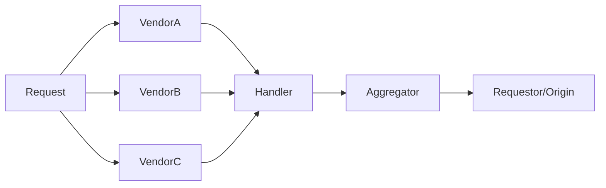

# Keywords and Glossary

Corpus              - A domain of information, typically referring to a set of texts.
NN                  - Neural Network. At its simplest this is a single perceptron (neuron).     
                        Typically, though, this is a model consisting of multiple "neurons" in multiple "layers".
Model               - A general term for the compiled relationship from training data. 
Perceptron          - A simple computer simulation of a neuron. Often used as a simple binary 
                        classification example algorithm.
transfer learning   - A research problem in which storing knowledge gained should be independent 
                        of the problem learnt from, and as such, applicable to a related problem.
classifier          - An algorithm that determines some relation between inputs and outputs, ie. 
                        "classification".
features            - An atomic or indivisible characteristic of a "thing" (phenomenon) under 
                    study.
prompt              - An initial input to bootstrap a model.
token               - Generally, a string of contiguous chars OR a any real number. A token 
                        is taken to be the atomic (granular) unit of operation for both the input and output domains.
                        3 levels are often used: word, char or n-gram chars.

# Papers and Sites of Interest

Predicting the title from the plot: https://www.diva-portal.org/smash/get/diva2:1571821/FULLTEXT02

NLP in Conditional Story Generation: https://towardsai.net/p/nlp/conditional-story-generation%E2%80%8A-%E2%80%8Apart-1

# Sci-Fi Examples

https://web.science.mq.edu.au/~rdale/resources/nlpinthemovies/index.html


# NLP Stuff

## What are the problems with NLP?

### Temporal
https://citeseerx.ist.psu.edu/viewdoc/download?doi=10.1.1.206.3779&rep=rep1&type=pdf

How do we ensure a chronological order is preserved/extracted/correctly induced?
"a then b because a required d so really it's d first, then a, and finally b"

### Attentive / Focussed
How do we ensure that we are on point?
"What time is it? I'm. Not. Drunk."

### Coherance
How do we ensure coherence as we progress? 
"the longer we go the more apples this becomes..."

### Causal

How do we correlate events?
"going to the supermarket implies driving there" 

### Other
https://monkeylearn.com/blog/natural-language-processing-challenges/
* Synonyms,
* Irony,
* Sarcasm,
* Ambiguity,
* Errors in the input (humans are not always correct, but we can correct on the fly),
* domain specificity,
* contextual words/phrases/homonyms
* colloquialisms/slang

## Timeline
50's - 90s, symbolic NLPs developed, rule based behaviour
80's - Recurrent NNs allow temporal behaviour to be incorporated.
97 - LSTM (Long Short Term Memory) solves teh RNNs "vanishing" gradient problem with a gate-based approach
90s - 10's, Stat's approaches (n-grams and bag-of-words), relationships accounted for
10+ , Neural NLP, deep learning allows high data density models to learn from much larger datasets,
14 - 17, seq-2-seq, attention behaviour and Encoder-Decoder architecture implemented,
18+ , transformers introduced - BLOODY HUUGE MODELS that incorp. transfer learning


## Models and Approaches

### n-Grams

set n = some integer then split a sentance into "grams",

> Hello world, nice to meet you

n = 1

> (Hello) (world), (nice) (to) (meet) (you)

n = 2

> (Hello world), (nice to) (meet you)

n = ...

### RNNs

it's *just* a for-loop + NN (and a metric shit tonne of processing)...
> I hope you remembered the exit condition...


These models "remember" dependencies between words. Much higher cost than n-grams.
However, the back-propagation relies on a gradient (sigmoid/softmax func), which can create instability. Keep in perspective that this alg' was suggested in the 80s and couldn't be implemented to any success until the "AI Cold Age" was over (around ~2010 when we got better CPUs and GPUs).

These cannot utilise transfer learning.

### LSTM 
LSTM is an improved implementation of the general RNN.

LSTM solves the backpropagation problem by gating the recurrant neurons (units). These cannot utilise transfer learning. They still require a pre-labeled dataset for the specific task to even function accurately.

LSTM is the basis for Encoder-Decoder systems, such as seq-2-seq.

GRU is a less-known alter.

#### Attention
https://medium.com/analytics-vidhya/https-medium-com-understanding-attention-mechanism-natural-language-processing-9744ab6aed6a

When decoding long sequences of output (a bunch of words), the xNN model struggles. This is increased when the training corpus sentence length increases. Attention is a an approach to solving this issue.

Attention attemps to focus on *where* the relavent information is located within the sentence. 

Attention mechanisms were added around ~2014, which gave the model a way to focus on relevant parts of a sentence - essentially allowing subject detection. 

Attention typically decreases learning time and increases accuracy on seq-2-seq problems.

### Encoder-Decoder Pattern/Architecture - NOT A MODEL ON ITS OWN
https://machinelearningmastery.com/implementation-patterns-encoder-decoder-rnn-architecture-attention/

An encoder...
Steps through input and creates a fixed-length vector. This is called the *context vector*.

A decoder...
Steps through the output and converts back to some appreciable form utilising the *context vector*.

### Deep Learning - assorted - Transformers

Deep learning utilises multiple layers, similar to NNs, to progressively determine features from the input.

Building further on the Encoder-Decoder architecture, Transformers avoid recurrance, as with RNNs.
Transformers instead rely on *Positional Encoding* to "reason" about a given word's placement. 
Relevancy scores are combined with Attention in a meta-classifier to create the "Deep Learning" model.

This work is obviously parallizable, as now we are training distinct models to be used by a meta classifier.

See examples of this such as,


### CNNs
Convolutional Neural Netoworks, see more here: https://towardsdatascience.com/a-comprehensive-guide-to-convolutional-neural-networks-the-eli5-way-3bd2b1164a53

Not often used for text-generation. Falls symptom to the "class imbalance" problem.

### GANs and VAEs
Generative Adversial Networks, like VAEs, are typically used in image generation tasks.
Variational Auto Encoders, like GANs, are typically used in image generation tasks.

These are difficult technically to create using RNNs, as the training often fails to converge.
There are solutions, such as the Gumbel-Softmax approx, or SeqGAN. These have varying degrees of success.

Rarely used for text-gen tasks, since they are more difficult to implement and less accurate than Transformers. See more on why here: https://www.reddit.com/r/MachineLearning/comments/40ldq6/generative_adversarial_networks_for_text/


# General Stuff I've used for Contex

## Patterns

### Pipes and Filters
https://www.enterpriseintegrationpatterns.com/patterns/messaging/PipesAndFilters.html
https://www.slmanju.com/2020/05/pipes-and-filters-architecture.html

An event or trigger scenario often requires a series of processing steps in handling the response.
Typically, this occurs as a result of handling an incoming `message`. This message may optionally 
require none, one, or many atomic processing steps. These are oftne inherently complex to address 
in a single class of code and may have no semantic interconnection. Further, observability and monitoring are not easily configured when desiging some easily imagined monolithic solution (e.g. an overloaded *builder*).

Through the use of **Pipes and Filters**, steps are divided into atomic, independent, handlers. 
These are then connected via channels (**Pipes**).

Each atomic step implements a simple interface,

```
interface Filter
    object Execute(object someInput)
```

This pattern allow easy composition, addition, deletion, and reconfiguration of steps. 

The pipeline is then defined as something such as,

```
class Pipeline
    list(Filter) _filters

    Pipeline(filters):
        _filters = filters

    object Process(input):
        _inputRef = input // or the language allows input mutation, then we can skip this
        foreach filter in _filters: 
            _inputRef = filter.Execute(input)

        return _inputRef // completed processing!
```

#### Aside:

Often the original input is referred to as a `pump`. Likewise, the output a `sink`.
Python example: https://deparkes.co.uk/2019/12/08/simple-python-pipes-and-filters/

### Visitor

### Event-Handler

### Scatter-Gather
https://www.enterpriseintegrationpatterns.com/patterns/messaging/BroadcastAggregate.html

This is simply a broadcast ("yell at the bus") to multiple recipients that is then re-consituted back into a single response. This is typically a pattern that aids in parellisation tasks.



### Builder

### Aggregator
https://www.enterpriseintegrationpatterns.com/patterns/messaging/Aggregator.html

The aggregator state machine takes input then identifies and applies a determinisitc order to return a single output. This is typically an iterable output but not necessarily.

### Configurator

### Pipelines

Most of the following "ETL" ish pipelines are discussed here by Eckerson Grp.
https://www.eckerson.com/articles/data-pipeline-design-patterns

The following are examples of *coupled* pipelines, i.e. they typically copy the data from the source into some temporary location rather than perform in-place operations.

### Raw data load
### ETL (Extract Transform Load)
### ELT (Extract Load then Transform)
The transformation is typically performed at a remote destination.

### Streaming ETL
Origin data is streamed and then parsed and filtered as per usual.

### OSEMN

https://www.kdnuggets.com/2018/05/beginners-guide-data-science-pipeline.html

* Obtain,
* Scrub/Clean
* Explore and Viz.
* Model (wizard time)
* iNterpretation

## Data Virtualisation

Rather than performing in place operations, it is possible to deliver the data as views without a distinct physical copy occuring. This requires some abstraction from the data origin.

Typically this is as so,


*see also CLEAN architecture...*

This is a rather convoluted way of explaining query-initiated data processing. The typical scenario is some semantic service in the app layer querying the DAL and returning a "neat" DTO/POCO intermediate.

### Minor Patterns

### SOLID
https://blog.cleancoder.com/uncle-bob/2020/10/18/Solid-Relevance.html


### Lamda
https://www.w3schools.com/python/python_lambda.asp

https://towardsdatascience.com/lambda-functions-with-practical-examples-in-python-45934f3653a8

```
x = lambda a : a + 10
print(x(5))

# or with a dataframe in practical example
print(list(filter(lambda x: x>18, df['age'])))
```

### Class Balancing

X, C., S. Sheng, V., 2011. ‘Class Imbalance Problem. Encyclopedia of Machine Learning’, <https://doi.org/doi.org/10.1007/978-0-387-30164-8_110>

Lemaitre, G., Nogueria, F., Oliveira, D., Aridas, C., 2017. ‘Imbalanced-learn: A Python Toolbox to Tackle the Curse of Imbalanced Datasets in Machine Learning’. Journal of Machine Learning Research, 17 18, 1–5

* Cost-Sensitive learners **or**,
* imbalanced-learn project (Lemaitre G. et al, 2017, p. 1), part of Sci-Kit
  * SMOTEENN (Synthetic Minority Oversampling Technique with Edited Nearest Neighbours)


### ML Models (Quick name-blast)

* SVM (Support Vector Machine)
* KNN (K-Nearest Neighbours)
* Decision Trees (Family: xtra trees, rand forest)
* MLP (Multilayer Perceptron)

### Transformations and Scalers

https://medium.com/arteos-ai/the-differences-between-sigmoid-and-softmax-activation-function-12adee8cf322#:~:text=Softmax%20is%20used%20for%20multi,in%20the%20Logistic%20Regression%20model.

Softmax is used for multi-classification in the Logistic Regression model, whereas Sigmoid is used for binary classification in the Logistic Regression model.

* Softmax
* Sigmoid
* Z-Score
* PCA (Principal Component Analysis)

https://builtin.com/data-science/step-step-explanation-principal-component-analysis

Typically an exploratory tool for large dimm datasets. It is at heart a dimensionality reduction method. This obviously comes at the cost of accuracy, but in trading accuracy we gain simplicity. 
Often this is used to explore in early stages a smaller "version" of the original dataset(s).

A way to standardise and compare data (correlate). Then solve the curse of dimensionality by reducing the data dimms. Computing eigen vectors and values of the covmat determines the principle components (dimensions). A feature vector of these PCs allows viz. and determination of which PCs to keep in later training. Data can optionally be recast into this new "hyper dimension".

* Min-Max Normalisation

### Load Balancers and Search Scaling (Meta predictors and hyper params)

https://www.datacamp.com/community/tutorials/parameter-optimization-machine-learning-models
https://stats.stackexchange.com/questions/285475/what-are-good-alternatives-to-grid-search

Meta predictors (typically trees) are a way of aggregating multiple inputs and/or models for improved overall accuracy. The paramaters of a meta predictor are called hyper paramaters. These hyper params can be tuned in a few ways such as,

* Grid Searching
Grid search is an approach to hyperparameter tuning that will methodically build and evaluate a model for each combination of algorithm parameters specified in a grid.

* Random Searching
OG Paper on random searching: http://www.jmlr.org/papers/volume13/bergstra12a/bergstra12a.pdf

Random search differs from a grid search. In that you longer provide a discrete set of values to explore for each hyperparameter; rather, you provide a statistical distribution for each hyperparameter from which values may be randomly sampled.

## Statistics and Validation

#### Measuring NLP Performance https://towardsdatascience.com/the-most-common-evaluation-metrics-in-nlp-ced6a763ac8b

These are expanded below anyway + some extra details xD.

### ROC (Receiver Operating Characteristic)

The ROC answers the question, "how sensitive is my model relative to its accuracy (what is the trade off)?"

https://developers.google.com/machine-learning/crash-course/classification/roc-and-auc#:~:text=An%20ROC%20curve%20(receiver%20operating,False%20Positive%20Rate

True positive vs. False Positive rate
### See also AUC (Area Under Curve): https://towardsdatascience.com/comprehension-of-the-auc-roc-curve-e876191280f9

### Accuracy

This answers the question, "how well does my model predict in a test?"
Simply the number of correctly identified results from the testing dataset represented as a percentage.

### Precission

https://community.expert.ai/articles-showcase-56/precision-and-recall-f-score-and-accuracy-measuring-nlp-performance-191#:~:text=Precision%3A%20Given%20a%20set%20of,Categorization%2C%20Entity%20Recognition%2C%20etc

This compares, the number of correctly identified target classes (lables in NLP) against the real classes. It can be considered the inverted measure of **noise**. 

### Confusion Matrix
https://machinelearningmastery.com/confusion-matrix-machine-learning/#:~:text=A%20confusion%20matrix%20is%20a%20summary%20of%20prediction%20results%20on,key%20to%20the%20confusion%20matrix

A confusion matrix is a summary of prediction results on a classification problem.

The number of correct and incorrect predictions are summarized with count values and broken down by each class (typically True, T, and False, F). 

It answers the question, "how confused is my model (when it makes predictions)?"

### Recall
https://community.expert.ai/articles-showcase-56/precision-and-recall-f-score-and-accuracy-measuring-nlp-performance-191#:~:text=Precision%3A%20Given%20a%20set%20of,Categorization%2C%20Entity%20Recognition%2C%20etc

How well can the model recall the positive (label) class. i.e. An inverted measure of **silence**.

### F1

Often both Precission as well as Recall are complementary. They have an inverse relation and are convenient to represent as a single score, the F1 score.

### MRR (Mean Reciprocal Rank)

Response retrieved in relation to a query given the probability of correctness.
See: https://en.wikipedia.org/wiki/Mean_reciprocal_rank

### MAP (Mean Average Precission)

Similar to MRR

Determines the mean precision per retreived result (often utilised in ranking).
See: https://towardsdatascience.com/breaking-down-mean-average-precision-map-ae462f623a52

### RMSE (Root Mean Square Error)

See also MAPE (often used together)
Often seen in regression analyses. It allows reviewing the error of a linear model without components below and above the line (regresion) cancelling each other.
See here (more into lin. reg): https://towardsdatascience.com/what-does-rmse-really-mean-806b65f2e48e#:~:text=Root%20Mean%20Square%20Error%20(RMSE)%20is%20a%20standard%20way%20to,model%20in%20predicting%20quantitative%20data.

### MAPE (Mean Absolute Percentage Error)

See also RMSE.
This represents accuracy as a percentage, rather than some integer (as RMSE does).
See more: https://www.indeed.com/career-advice/career-development/what-is-mape

### BLEU (Bilingual Evaluation Understudy)

This score determines the quality of text as translated by a machine between two natural languages.

### METEOR (Metric for Evaluation of Translation with Explicity ORdering)

Precission based metric for evaluation of translation-to-machine-to-translation operations. It is a successor in some ways to BLEU. It accounts for synonyms.

### ROUGE (Recall-Orientated Understy for Gisting Evaluation)

A recall based metric for evalution of machine generated texts as well as translation-to-machine-to-translation operations. It is typically used in summarization tasks for obvious reasons, as the recall of specific vocabularly is important when surmising.

### Perplexity

A measure of confusion, semantically similar toa confusion matrtix as seen in binary classification models. See here for more details, https://towardsdatascience.com/perplexity-in-language-models-87a196019a94


## Search Strategies (Sampling)

Given a sampling such as, picking based on a condition prob. dist...

### Greedy sampling
Always pick the highest prob.

### Beam Search
Track the top k probable options, reevaluate and reduce these when more samples become available.


### Top K

### Top P (Nucleus Sampling) 

### Temperature Sampling
